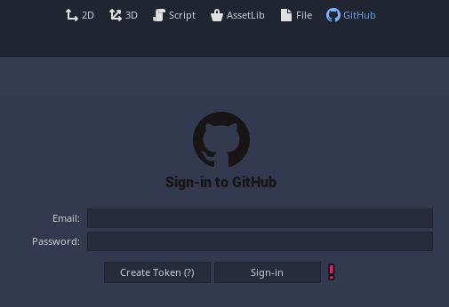
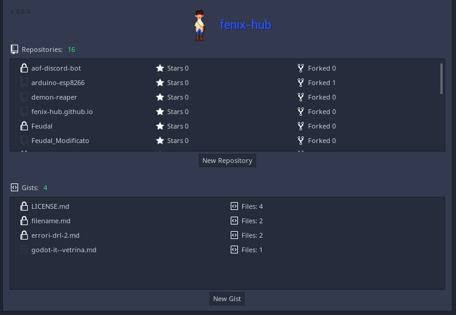
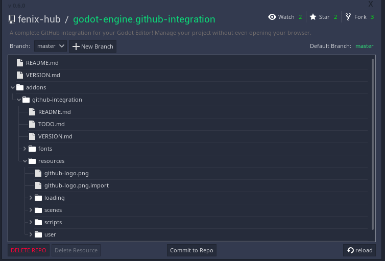
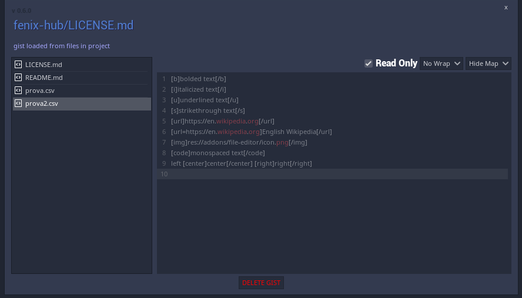

📣 Check my **[Discord](https://discord.gg/KnJGY9S)** to stay updated on this repository.  
*(Recommended since the AssetLibrary is not automatically updated)*  

This plugin is now supported in [Godot Extended Library Discord](https://discord.gg/JNrcucg), check out the [Godot Extended Library Project](https://github.com/godot-extended-libraries)!

# GitHub Integration
A complete GitHub integration for your Godot Editor! Manage your project without even opening your browser.

Author: *"Nicolo (fenix) Santilio"*  
Version: *0.6.0*  
Godot Version: *3.2alpha2*  

**This repository was pushed directly from Godot Engine Editor, and README and VERSION files were edited with [TextEditor Integration](https://github.com/fenix-hub/godot-engine.text-editor) directly in Godot Editor.**

## What is this?
*GitHub Integration* is a addon for Godot Engine that I've created mainly for a personal purpose.  
Pushing and Pulling personal repositories while I'm working on Godot (especially if I'm under a GameJam) could take some time and force me to save the project, open the brwoser/git bash/git gui, and do all the stuff.  
With this little addon which works directly in the editor, managing all your repositories will be very easy.  

## How does it work?
As soon as you download end activate the addon, a "GitHub" tool button will appear..  
1. Sign in with your credentials: the field *"password"* can also be filled with a *"token"*. To know about GitHub tokens and how to create them, click on the *"Create Token"* button.  

2. Once you have signed in, your *"User Panel"* will load. Here you can see your avatar, profile name, number and list of repositories, number and list of gists. You will always see all you repositories and gists in your GitHub account, but the private ones will be tagged with a "lock" icon.  

3. With *"New Repository*" and *"New Gist*" buttons you can create a new Repository or Gist.  
4. With a **double click** on one of your repositories (or a gists) you will enter the *"Repository*" (or *Gist*) panel, where you will be able to manage everything (delete, commit).  

## How do I install it?
Just download [this whole repository](https://github.com/fenix-hub/godot-engine.github-integration/tree/master) and put it in your `res://` folder inside the project you want to work on.  
Then, go to `Project > Plugins > "GitHub Integration" > Status > Activate`.  

### What do I want for a v-1.0.0 ?
The first complete and released version will be set once the main operations you can do on GitHub browser and app will be available in this addon (ex. Committing and Pushing, Branching, Pulling) placed side by side with a full error handling.

# ⚠️ Disclaimer  
This addon was built for a **personal use** intention. It was released as an open source plugin in the hope that it could be useful to the Godot Engine Community.  
As a "work in progress" project, there is *no warranty* for any eventual issue and bug that may broke your project.  
I don't assume any responsibility for possible corruptions of your project. It is always advisable to keep a copy of your project and check any changes you make in your Github repository.  
